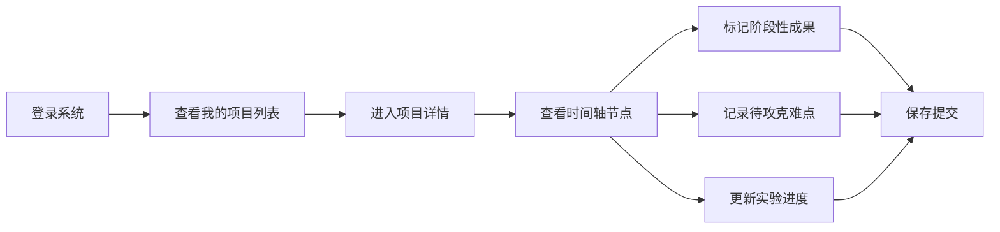
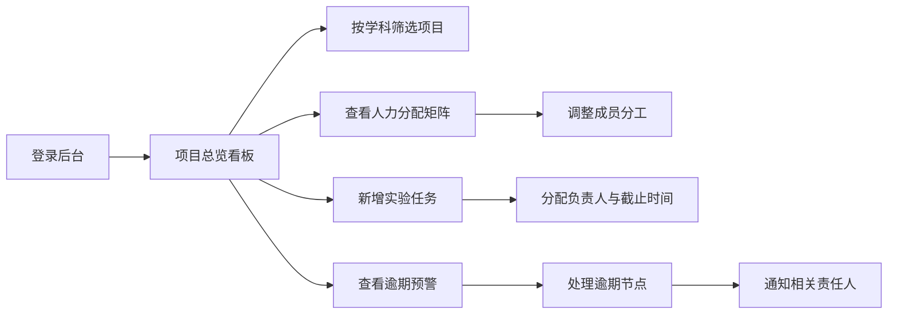

## 1. 产品概述

科研项目协同管理系统，实现科研项目全生命周期的可视化管理。后端8832端口统一承载项目节点、人员分工数据，前端3831端口提供双端界面，分别面向科研人员与课题总负责人，支持时间轴可视化、成果标记、人力分配、逾期预警等核心功能。

- 核心目标：提升科研项目管理效率，实现多课题组协同的可视化管控
- 目标用户：科研人员、课题总负责人、项目管理者
- 市场价值：解决科研项目进度跟踪难、人力分配不透明、节点逾期风险不可控等痛点

## 2. 核心功能

### 2.1 用户角色

| 角色 | 注册方式 | 核心权限 |
|------|----------|----------|
| 科研人员 | 系统分配账号 | 查看负责项目、标记阶段性成果、记录待攻克难点、更新实验进度 |
| 课题总负责人 | 系统分配管理员账号 | 全项目概览、人力分配调整、新增实验任务、逾期预警处理、学科分组筛选 |

### 2.2 功能模块

1. **科研人员工作台**：项目列表、时间轴可视化、成果标记、难点记录、进度更新
2. **负责人后台看板**：项目总览、人力分配矩阵、任务管理、逾期预警中心、学科分组筛选
3. **时间轴可视化**：项目节点展示、进度条、状态标识、交互操作
4. **人员分工管理**：成员列表、分工调整、工作量统计、任务分配
5. **预警与筛选**：逾期标红、学科筛选、进度统计、状态过滤

### 2.3 页面详情

| 页面名称 | 模块名称 | 功能描述 |
|---------|----------|----------|
| 登录页 | 角色选择登录 | 支持科研人员/负责人双角色登录，账号密码验证 |
| 科研人员-项目列表 | 我的项目 | 展示负责参与的所有项目，支持状态筛选、搜索 |
| 科研人员-项目详情 | 时间轴可视化 | 纵向时间轴展示实验节点，可标记成果、难点，更新进度 |
| 负责人-项目总览 | 项目看板 | 卡片式展示所有项目进度，支持学科筛选、状态过滤 |
| 负责人-人力分配 | 人员管理看板 | 矩阵式展示各课题组人力分配，支持拖拽调整成员分工 |
| 负责人-任务管理 | 实验任务管理 | 新增/编辑/删除实验任务，设置负责人、截止时间 |
| 负责人-预警中心 | 逾期预警 | 标红展示所有逾期节点，支持一键通知责任人 |
| 全局组件 | 顶部导航 | 角色切换、消息通知、个人中心、退出登录 |

## 3. 核心流程

### 3.1 科研人员工作流程

### 3.2 负责人管理流程

## 4. 用户界面设计

### 4.1 设计风格

- **主色调**：深邃科技蓝 (#1E3A8A)，代表科研的严谨与专业
- **辅助色**：
  - 完成状态：翠绿色 (#10B981)
  - 进行中：活力橙 (#F59E0B)
  - 逾期预警：警示红 (#EF4444)
  - 难点标记：高贵紫 (#8B5CF6)
- **按钮风格**：微圆角 (8px)、轻投影、悬停微动效
- **字体**：
  - 标题：'Noto Serif SC' 宋体，体现学术感
  - 正文：'Inter' 无衬线，保证可读性
- **布局风格**：卡片式布局、左侧导航、顶部状态栏、内容区网格化
- **图标风格**：线性简约图标，配合状态色彩区分

### 4.2 页面设计概述

| 页面名称 | 模块名称 | UI元素 |
|---------|----------|--------|
| 登录页 | 角色选择 | 渐变背景、双角色卡片、登录表单、品牌标识 |
| 科研人员-项目列表 | 我的项目 | 项目卡片网格、状态徽章、搜索框、筛选器 |
| 科研人员-项目详情 | 时间轴 | 纵向时间轴、节点卡片、进度条、操作按钮、弹窗表单 |
| 负责人-项目总览 | 项目看板 | 统计卡片、项目列表、学科筛选标签、状态图例 |
| 负责人-人力分配 | 人员矩阵 | 表格布局、拖拽手柄、头像组、工作量进度条 |
| 负责人-任务管理 | 任务列表 | 任务卡片、优先级标识、截止日期、编辑操作 |
| 负责人-预警中心 | 预警列表 | 红色高亮卡片、逾期天数、通知按钮、处理状态 |
| 全局 | 导航栏 | 深色侧边栏、活跃状态高亮、面包屑导航 |

### 4.3 响应式设计

- **桌面端优先**：1920px 基准设计，支持 1280px-2560px 自适应
- **平板适配**：≥768px，侧边栏可收起，网格布局自动调整列数
- **交互优化**：支持键盘快捷键、拖拽操作、悬停预览、右键菜单

### 4.4 动效与交互

- **页面加载**：内容淡入 + 元素错位入场动画
- **时间轴交互**：节点悬停放大、进度条平滑增长动画
- **状态切换**：颜色渐变过渡、徽章弹跳动效
- **逾期预警**：呼吸灯动效、边缘脉冲提示
- **拖拽操作**：元素半透明跟随、放置位置高亮提示
