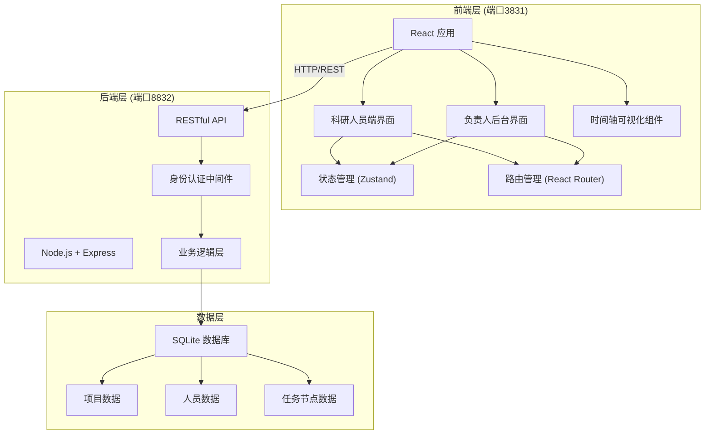
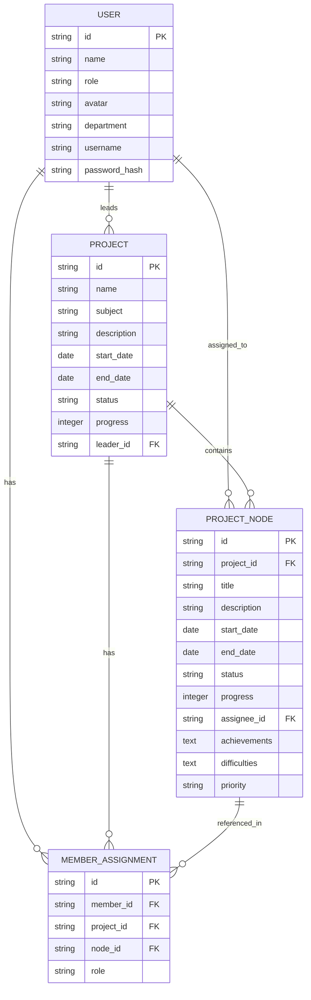

## 1. 架构设计



## 2. 技术描述

- **前端**：React@18 + TypeScript + Vite + tailwindcss@3 + Zustand + React Router v6
- **后端**：Node.js + Express@4 + TypeScript + cors + sqlite3
- **数据库**：SQLite（嵌入式，无需额外部署），项目启动时自动初始化Mock数据
- **端口规划**：
  - 后端服务：8832端口（承载所有数据和业务逻辑）
  - 前端开发服务：3831端口（双端界面统一入口，通过路由区分角色）
- **数据交互**：RESTful API + JSON，前端通过代理访问后端

## 3. 路由定义

### 前端路由

| 路由 | 页面 | 权限角色 |
|------|------|----------|
| / | 登录页 | 公开 |
| /researcher/projects | 科研人员-项目列表 | 科研人员 |
| /researcher/projects/:id | 科研人员-项目详情 | 科研人员 |
| /admin/dashboard | 负责人-项目总览 | 总负责人 |
| /admin/team | 负责人-人力分配 | 总负责人 |
| /admin/tasks | 负责人-任务管理 | 总负责人 |
| /admin/alerts | 负责人-预警中心 | 总负责人 |

### 后端API路由

| 方法 | 路由 | 用途 |
|------|------|------|
| POST | /api/auth/login | 用户登录认证 |
| GET | /api/projects | 获取项目列表（支持学科/状态筛选） |
| GET | /api/projects/:id | 获取项目详情（含节点时间轴） |
| PUT | /api/projects/:id/nodes/:nodeId | 更新节点状态、标记成果/难点 |
| GET | /api/team | 获取团队人员列表及分工 |
| PUT | /api/team/members/:memberId | 调整成员分工 |
| POST | /api/projects/:id/nodes | 新增实验任务节点 |
| GET | /api/alerts/overdue | 获取逾期节点列表 |
| POST | /api/alerts/:alertId/notify | 发送逾期通知 |

## 4. API 类型定义

```typescript
// 通用类型
interface User {
  id: string;
  name: string;
  role: 'researcher' | 'admin';
  avatar: string;
  department: string;
}

interface Project {
  id: string;
  name: string;
  subject: string;
  description: string;
  startDate: string;
  endDate: string;
  status: 'planning' | 'in_progress' | 'completed' | 'delayed';
  progress: number;
  leaderId: string;
  memberIds: string[];
  nodes: ProjectNode[];
}

interface ProjectNode {
  id: string;
  projectId: string;
  title: string;
  description: string;
  startDate: string;
  endDate: string;
  status: 'pending' | 'in_progress' | 'completed' | 'delayed';
  progress: number;
  assigneeId: string;
  achievements: string[];
  difficulties: string[];
  priority: 'low' | 'medium' | 'high';
}

interface TeamMember {
  id: string;
  name: string;
  avatar: string;
  title: string;
  skills: string[];
  currentProjectIds: string[];
  workload: number;
  assignments: MemberAssignment[];
}

interface MemberAssignment {
  projectId: string;
  projectName: string;
  nodeId: string;
  nodeName: string;
  role: string;
}

// 请求响应
interface LoginRequest {
  username: string;
  password: string;
}

interface LoginResponse {
  token: string;
  user: User;
}

interface UpdateNodeRequest {
  status?: ProjectNode['status'];
  progress?: number;
  achievements?: string[];
  difficulties?: string[];
}

interface CreateNodeRequest {
  title: string;
  description: string;
  startDate: string;
  endDate: string;
  assigneeId: string;
  priority: 'low' | 'medium' | 'high';
}

interface UpdateAssignmentRequest {
  projectId: string;
  nodeId: string;
  role: string;
}
```

## 5. 数据模型

### 6.1 ER图



### 6.2 数据初始化SQL

```sql
-- 用户表
CREATE TABLE users (
  id TEXT PRIMARY KEY,
  name TEXT NOT NULL,
  role TEXT NOT NULL CHECK(role IN ('researcher', 'admin')),
  avatar TEXT,
  department TEXT,
  username TEXT UNIQUE NOT NULL,
  password_hash TEXT NOT NULL
);

-- 项目表
CREATE TABLE projects (
  id TEXT PRIMARY KEY,
  name TEXT NOT NULL,
  subject TEXT NOT NULL,
  description TEXT,
  start_date TEXT NOT NULL,
  end_date TEXT NOT NULL,
  status TEXT NOT NULL DEFAULT 'planning',
  progress INTEGER DEFAULT 0,
  leader_id TEXT REFERENCES users(id)
);

-- 项目节点表
CREATE TABLE project_nodes (
  id TEXT PRIMARY KEY,
  project_id TEXT REFERENCES projects(id) ON DELETE CASCADE,
  title TEXT NOT NULL,
  description TEXT,
  start_date TEXT NOT NULL,
  end_date TEXT NOT NULL,
  status TEXT NOT NULL DEFAULT 'pending',
  progress INTEGER DEFAULT 0,
  assignee_id TEXT REFERENCES users(id),
  achievements TEXT DEFAULT '[]',
  difficulties TEXT DEFAULT '[]',
  priority TEXT NOT NULL DEFAULT 'medium'
);

-- 成员分工表
CREATE TABLE member_assignments (
  id TEXT PRIMARY KEY,
  member_id TEXT REFERENCES users(id) ON DELETE CASCADE,
  project_id TEXT REFERENCES projects(id) ON DELETE CASCADE,
  node_id TEXT REFERENCES project_nodes(id) ON DELETE CASCADE,
  role TEXT NOT NULL
);

-- 索引
CREATE INDEX idx_projects_subject ON projects(subject);
CREATE INDEX idx_projects_status ON projects(status);
CREATE INDEX idx_nodes_project ON project_nodes(project_id);
CREATE INDEX idx_nodes_status ON project_nodes(status);
CREATE INDEX idx_nodes_assignee ON project_nodes(assignee_id);
CREATE INDEX idx_assignments_member ON member_assignments(member_id);
```

### 6.3 Mock数据说明

系统启动时自动初始化以下Mock数据：
- **2名负责人**：admin/admin123
- **8名科研人员**：researcher1/researcher2... 密码均为 123456
- **6个科研项目**：覆盖物理、化学、生物、计算机、材料、环境6个学科
- **每个项目5-7个实验节点**：包含不同状态（待开始/进行中/已完成/逾期）
- **人员分工数据**：每个科研人员参与1-3个项目
- **逾期节点**：约30%节点设置为逾期状态用于展示预警功能
